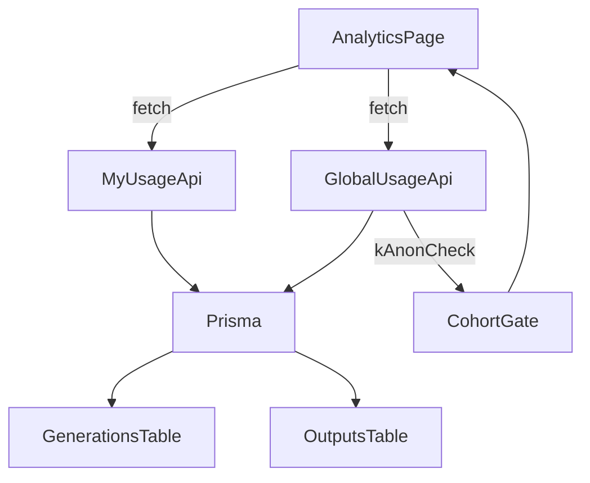

# Dashboard Analytics (My + Global)

## What we’re building (Phase 1)

- **New page**: `/analytics` at `[app/(dashboard)/analytics/page.tsx](app/\(dashboard)/analytics/page.tsx)`.
- **Navigation**: Add **Analytics** directly under **Dashboard** in the left sidebar and mobile nav.
- **Split view**: Tabs for **My** vs **Global (anonymized)**.
- **Visualizations (non-fluffy)**:
- **Model mix**: top models by generation count and share.
- **Provider & media type breakdown**: based on `ModelConfig.provider` and `ModelConfig.type` (image/video).
- **Clear disclaimers**: Global is aggregated, no prompts/outputs shown.

Design inspiration will follow the “Dashboard Shell” style (metric cards + clean breakdown sections) from Shadcn Studio’s block library: [Shadcn Dashboard Shell](https://shadcnstudio.com/blocks/dashboard-and-application/dashboard-shell).

## Data sources we’ll use

- **Per-user usage** (already exists): [`app/api/analytics/usage/route.ts`](app/api/analytics/usage/route.ts).
- **Global usage** (new): aggregated across all users with a **k-anonymity threshold**.
- **Model metadata**: `modelRegistry` in [`lib/models/registry.ts`](lib/models/registry.ts) and `ModelConfig` (`provider`, `type`) in [`lib/models/base.ts`](lib/models/base.ts).
- **DB**: `Generation.modelId`, `Generation.userId`, and outputs in [`prisma/schema.prisma`](prisma/schema.prisma).

## API changes

- **Add** [`app/api/analytics/global/usage/route.ts`](app/api/analytics/global/usage/route.ts):
- Requires auth (same as other analytics endpoints).
- Computes:
    - `totalGenerations`, `totalImages`, `totalVideos`
    - `topModels` (same shape as existing)
    - `byProvider` (provider → count/share)
    - `byType` (image vs video counts)
    - `cohort` info: `uniqueUsers`, `minUsersRequired`
- Enforce k-anon: if `uniqueUsers < minUsersRequired`, return a safe response (e.g., `available:false`) and the UI shows “Not enough data yet.”
- **Optionally extend** existing [`app/api/analytics/usage/route.ts`](app/api/analytics/usage/route.ts) to include `byProvider` and `byType` too, so the UI can reuse one rendering component for both scopes.

## UI implementation

- **Update sidebar**: [`components/layout/DashboardSidebar.tsx`](components/layout/DashboardSidebar.tsx)
- Add a new nav item `Analytics` under the top “Dashboard” section.
- **Update mobile header nav**: [`components/layout/DashboardHeader.tsx`](components/layout/DashboardHeader.tsx)
- Add `Analytics` to `mobileNavItems`.
- **New page UI**: `[app/(dashboard)/analytics/page.tsx](app/\(dashboard)/analytics/page.tsx)`
- Title + short description.
- Tabs: **My** (calls `/api/analytics/usage`) and **Global** (calls `/api/analytics/global/usage`).
- Reuse existing shadcn/ui primitives (`Card`, `Tabs`) and the existing progress-bar style used in [`components/settings/AnalyticsSettings.tsx`](components/settings/AnalyticsSettings.tsx).
- Keep visuals “honest”: no vanity metrics; prefer clear counts + shares.

## Phase 2 (foundation for semantic analytics — next step after Phase 1)

Once the Analytics page is in place, we’ll add the real “pattern-finding” foundation:

- **Schema**: new Prisma model(s) to store anonymized derived descriptors (prompt analysis, image/video captions, tags, maybe embeddings later).
- **Pipeline**: background job to run Gemini multimodal analysis on new outputs and store results.
- **Analytics expansion**: prompt keyword clusters, style/theme distributions, correlations between prompt facets and approvals/bookmarks, etc.

## Acceptance checks

- Sidebar shows **Analytics** under **Dashboard**.
- `/analytics` renders and loads **My** and **Global** tabs.
- Global tab hides metrics until k-anon threshold is met.