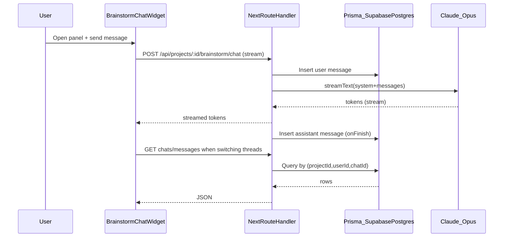

# Project Brainstorm Chatbot (bottom-right widget)

## Goals

- Add a **new** bottom-right floating chat widget (Messenger-style) on project pages (no changes to the prompt bar).
- Power it with **Claude (Opus 4.5)** for high-level creative brainstorming, while reusing the existing skill system (notably `genai-prompting`).
- Persist chats **per user + per project** in Supabase Postgres (multi-thread: create/switch/delete chats).
- Use **Vercel AI SDK** streaming + `useChat` patterns for a polished chatbot experience.

References:

- Claude Developer Platform docs: [`https://platform.claude.com/docs/en/home`](https://platform.claude.com/docs/en/home)
- Vercel AI SDK: [`https://ai-sdk.dev/docs/introduction`](https://ai-sdk.dev/docs/introduction)
- Vercel Next.js AI Chatbot template patterns: [`https://vercel.com/templates/next.js/nextjs-ai-chatbot`](https://vercel.com/templates/next.js/nextjs-ai-chatbot)

## What we’ll build

### UX

- A **floating button** pinned to the bottom-right of the viewport.
- Clicking opens a **small floating panel** (chat window) above it.
- Inside the panel:
- **Chat selector** (switch between threads)
- **New chat**
- **Delete chat**
- Streaming chat messages + input box
- When navigating to a different project (`/projects/[id]`), the widget switches context and shows that project’s chats (or an empty/new chat if none exist).

### Data model (Supabase Postgres via Prisma)

Add two Prisma models in [`prisma/schema.prisma`](prisma/schema.prisma):

- `ProjectChat`: chat thread metadata (`projectId`, `userId`, `title`, timestamps)
- `ProjectChatMessage`: message rows (`chatId`, `role`, `content`, timestamps)

This keeps chats:

- **isolated by user** (owner/member each has their own threads)
- **scoped by project**
- easy to list/switch/delete

## Backend/API design

We’ll follow existing auth + access patterns from `[app/api/projects/[id]/route.ts](app/api/projects/[id]/route.ts)` (owner OR invited member).

### Routes (new)

- **List + create threads**: `[app/api/projects/[id]/brainstorm/chats/route.ts](app/api/projects/[id]/brainstorm/chats/route.ts)`
- `GET`: list chats for `(projectId, userId)`
- `POST`: create a new chat thread for `(projectId, userId)`
- **Delete thread**: `[app/api/projects/[id]/brainstorm/chats/[chatId]/route.ts](app/api/projects/[id]/brainstorm/chats/[chatId]/route.ts)`
- `DELETE`: delete a chat and cascade-delete its messages
- **Fetch messages for a thread**: `[app/api/projects/[id]/brainstorm/chats/[chatId]/messages/route.ts](app/api/projects/[id]/brainstorm/chats/[chatId]/messages/route.ts)`
- `GET`: return ordered messages (for `initialMessages`)
- **Streaming chat (LLM)**: `[app/api/projects/[id]/brainstorm/chat/route.ts](app/api/projects/[id]/brainstorm/chat/route.ts)`
- `POST`: AI SDK streaming endpoint
- Validates user + project access
- Persists the user message, streams Claude’s response, then persists the assistant message on finish

## LLM prompt strategy (skills)

- Add a dedicated brainstorming skill: [`lib/skills/brainstorming.skill.md`](lib/skills/brainstorming.skill.md)
- In the brainstorming chat route, we’ll load:
- `brainstorming` (new)
- `genai-prompting` (existing)
- Then append a small “override” instruction so the chat can be conversational (the strict “return ONLY the prompt” rule from `genai-prompting` should apply **only** when the user explicitly asks for a final prompt).

## Frontend implementation

### New widget component

- Create [`components/brainstorm/BrainstormChatWidget.tsx`](components/brainstorm/BrainstormChatWidget.tsx)
- Uses `useChat` from the AI SDK UI to stream responses.
- Manages:
- fetching chat list
- selecting active chat
- loading `initialMessages` for that chat
- creating/deleting chats
- Panel styling: fixed, bottom-right, `w-[380px]`-ish, `h-[520px]`-ish, responsive fallback on small screens.

### Mount point

- Render the widget only on project pages by adding it to `[app/projects/[id]/page.tsx](app/projects/[id]/page.tsx)`.

## Dependencies + env

- Add AI SDK deps:
- `ai` (AI SDK core + UI hooks)
- `@ai-sdk/anthropic` (Anthropic provider for AI SDK)
- Env:
- reuse `ANTHROPIC_API_KEY`
- add `ANTHROPIC_BRAINSTORM_MODEL` (set to your preferred **Opus 4.5** model ID)

## Data flow (high level)

## Acceptance criteria

- Bottom-right button appears on `/projects/[id]`.
- Panel opens/closes and streams responses.
- Chats are persisted per user+project:
- New project ⇒ no history (auto-creates an empty chat or shows empty state then creates on first message).
- Switching projects switches chat context.
- Multi-thread support:
- create new chat
- switch chats
- delete chat
- No changes to the prompt bar / existing prompt enhancement.