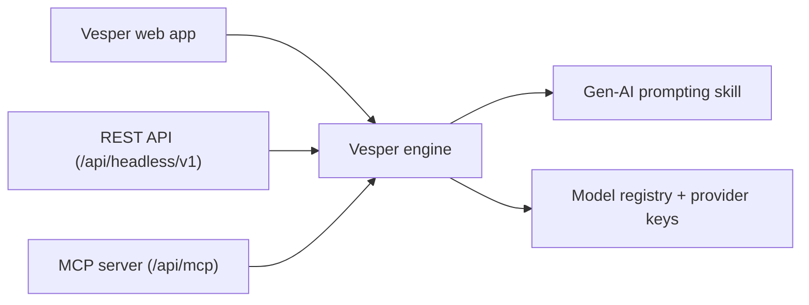

# Vesper Headless API + MCP

The Vesper headless surface lets external tools call Loop's prompt
substrate and (later) generation engine without ever receiving Gemini,
OpenAI, Replicate, or Anthropic API keys.

The same underlying engine powers four surfaces today:



External callers receive a `vsp_live_*` bearer token. The token is
scoped per credential, can be revoked, and never leaves the database in
plaintext after creation.

---

## 1. Auth model

| Concept | Where it lives | Notes |
|---------|----------------|-------|
| Owner profile | `Profile` (existing) | Every credential is owned by a Loop user. Paused / deleted owners cannot use their tokens. |
| Credential | `HeadlessCredential` | Hashed token, allowlists, rate-limit policy, revocation. |
| Audit log | `HeadlessUsageLog` | One row per request. |
| Rate buckets | `HeadlessRateBucket` | Durable per-credential minute + day buckets. |

Tokens look like `vsp_live_<16-hex-prefix>_<48-hex-secret>`. The prefix is
non-secret and used in dashboards and audit logs. Only the SHA-256 hash
is stored, so the database never sees the plaintext after issuance.

`INTERNAL_API_SECRET` is **not** used for headless auth. That secret
remains scoped to internal worker-to-worker calls and intentionally
bypasses resource checks; reusing it externally would be unsafe.

---

## 2. Issuing a credential (admin)

```bash
curl -X POST "$BASE_URL/api/admin/headless-credentials" \
  -H "Cookie: <admin session cookie>" \
  -H "Content-Type: application/json" \
  -d '{
    "ownerId": "<damien-profile-uuid>",
    "name": "Damien — Cursor",
    "allowedTools": ["enhance_prompt", "iterate_prompt", "list_models"],
    "allowedModels": [
      "gemini-nano-banana-pro",
      "gemini-nano-banana-2",
      "openai-gpt-image-2",
      "google-veo-3.1"
    ],
    "rateLimitPerMinute": 30,
    "rateLimitPerDay": 2000
  }'
```

The response includes the plaintext `rawToken` exactly once. Save it
immediately and hand it to the integrator over a secure channel.

To list credentials: `GET /api/admin/headless-credentials`.
To revoke: `DELETE /api/admin/headless-credentials/<id>` with optional
`{ "reason": "..." }` JSON body.

Set `allowedModels: ["*"]` for a full-access token. Empty `allowedModels`
means "no models", which still permits handshake and discovery but blocks
every tool call that requires a model.

---

## 3. REST API

Base URL: `https://<vesper-host>/api/headless/v1`

### `GET /` — discovery (no auth)

```bash
curl "$BASE_URL/api/headless/v1"
```

Returns the surface version, supported tools, and pointers to authenticated
routes. Useful for an integrator to confirm they're hitting Vesper before
configuring credentials.

### `POST /prompts/enhance`

```bash
curl -X POST "$BASE_URL/api/headless/v1/prompts/enhance" \
  -H "Authorization: Bearer $VSP_TOKEN" \
  -H "Content-Type: application/json" \
  -d '{
    "prompt": "documentary still of an elderly potter at a wheel",
    "modelId": "gemini-nano-banana-pro"
  }'
```

Response:

```json
{
  "originalPrompt": "documentary still of an elderly potter at a wheel",
  "enhancedPrompt": "...",
  "modelId": "gemini-nano-banana-pro",
  "enhancementModel": "claude-sonnet-4-5-20250929",
  "enhancementPromptId": null,
  "skill": {
    "skillId": "genai-prompting",
    "hash": "a1b2c3d4e5f6",
    "lastModified": "2026-05-04T11:48:00.000Z"
  }
}
```

Optional fields:

| Field | Purpose |
|-------|---------|
| `referenceImage` | `data:image/...;base64,...` URL. Triggers style-only or compositional enhancement based on prompt language. Capped at 6 MB. |

### `POST /prompts/iterate`

```bash
curl -X POST "$BASE_URL/api/headless/v1/prompts/iterate" \
  -H "Authorization: Bearer $VSP_TOKEN" \
  -H "Content-Type: application/json" \
  -d '{
    "prompt": "Loop Switch earplugs for focus workers",
    "modelId": "gemini-nano-banana-pro",
    "anchors": {
      "product": "Loop Switch",
      "offer": "Free shipping",
      "audience": "Focus workers in open offices",
      "brand": "Loop tone-of-voice rules; logo bottom-right"
    },
    "variantCount": 4,
    "preferredAxes": ["Concept", "Persona", "Visual Treatment"]
  }'
```

Returns the structured `slate` JSON described in the Iteration Slate
Mode section of the Gen-AI prompting skill, plus the `skill` version
block.

### `GET /models`

```bash
curl "$BASE_URL/api/headless/v1/models" \
  -H "Authorization: Bearer $VSP_TOKEN"
```

Returns only the models the calling credential is permitted to use.

### Standard response headers

Every authenticated response includes:

```
X-RateLimit-Limit-Minute: 60
X-RateLimit-Remaining-Minute: 58
X-RateLimit-Reset-Minute: 27
X-RateLimit-Limit-Day: 5000
X-RateLimit-Remaining-Day: 4988
X-RateLimit-Reset-Day: 41280
```

When a window is exhausted, the response is `429` with a `Retry-After`
header.

### Error shape

Every error response is JSON-shaped:

```json
{
  "error": "human-readable message",
  "errorCategory": "auth | rate_limited | upstream_unavailable | content_safety | validation | internal"
}
```

`errorCategory` follows the same taxonomy as `lib/errors/classification.ts`,
so dashboards can compare browser and headless errors apples-to-apples.

---

## 4. MCP server

Base URL: `https://<vesper-host>/api/mcp`

The endpoint speaks MCP over Streamable HTTP (JSON-RPC 2.0 over POST).
It's compatible with:

- **Anthropic's MCP connector** (`mcp-client-2025-11-20` beta header).
- **Cursor's MCP host** (configured via Settings → MCP).
- **Any MCP runtime** that supports remote URL transports.

### Configuring Claude (MCP connector)

```bash
curl https://api.anthropic.com/v1/messages \
  -H "Content-Type: application/json" \
  -H "X-API-Key: $ANTHROPIC_API_KEY" \
  -H "anthropic-version: 2023-06-01" \
  -H "anthropic-beta: mcp-client-2025-11-20" \
  -d '{
    "model": "claude-opus-4-7",
    "max_tokens": 1024,
    "messages": [
      { "role": "user", "content": "Enhance this Nano Banana prompt and list the variants Andromeda would reward." }
    ],
    "mcp_servers": [
      {
        "type": "url",
        "url": "https://<vesper-host>/api/mcp",
        "name": "vesper",
        "authorization_token": "vsp_live_..."
      }
    ],
    "tools": [
      { "type": "mcp_toolset", "mcp_server_name": "vesper" }
    ]
  }'
```

Constraints from Anthropic's docs that we already satisfy:

- Public HTTPS server (Vercel deployment).
- Only `tools/*` methods are required for the connector — we expose
  `initialize`, `notifications/initialized`, `ping`, `tools/list`, `tools/call`.
- Bearer token is passed by the connector as `authorization_token`.

### Configuring Cursor

In Cursor's Settings → MCP → Add server:

```json
{
  "vesper": {
    "url": "https://<vesper-host>/api/mcp",
    "headers": {
      "Authorization": "Bearer vsp_live_..."
    }
  }
}
```

Cursor will call `initialize` and `tools/list` on first connect, then
expose `enhance_prompt`, `iterate_prompt`, and `list_models` as native
tools.

### Configuring a generic MCP client

The transport is plain JSON-RPC 2.0 over HTTP POST:

```bash
curl -X POST "$BASE_URL/api/mcp" \
  -H "Authorization: Bearer $VSP_TOKEN" \
  -H "Content-Type: application/json" \
  -d '{
    "jsonrpc": "2.0",
    "id": 1,
    "method": "initialize",
    "params": {
      "protocolVersion": "2025-11-25",
      "clientInfo": { "name": "damien-tool", "version": "0.1.0" }
    }
  }'
```

Then `tools/list` and `tools/call`.

---

## 5. Hard constraints

The headless surface intentionally refuses several things to keep blast
radius small:

| Constraint | Reason |
|------------|--------|
| No provider keys are exposed to callers. | A leak of a Vesper token cannot leak Loop's Gemini / OpenAI / Replicate credentials. |
| Empty `allowedModels` blocks every model call. | Default deny — admin must explicitly opt a model in. |
| `allowedTools` enforced on every REST and MCP call. | A leak cannot pivot from `list_models` to `iterate_prompt`. |
| Reference images capped at 6 MB. | Bounds memory + Anthropic token spend per request. |
| `generate_asset` is intentionally not implemented. | Generation requires session/project membership; we'll add it once those scopes are encoded on the credential. |
| Plaintext token shown exactly once. | Lost tokens cannot be recovered — they must be re-issued. |

---

## 6. Operational notes

- Rotate Damien's token by issuing a new credential, swapping it in his
  tooling, and revoking the old one. There's no in-place rotation API.
- Audit `HeadlessUsageLog` for unexpected spikes — every request is one
  row, including failures.
- Rate-limit buckets accumulate in `HeadlessRateBucket`. Old buckets are
  not pruned today; add a cron job once the table grows past comfort.
- `lastUsedAt` is updated best-effort. Use it to spot stale credentials.
- The MCP server is stateless — there's no session to keep alive between
  calls. Each MCP request must include the bearer token.
