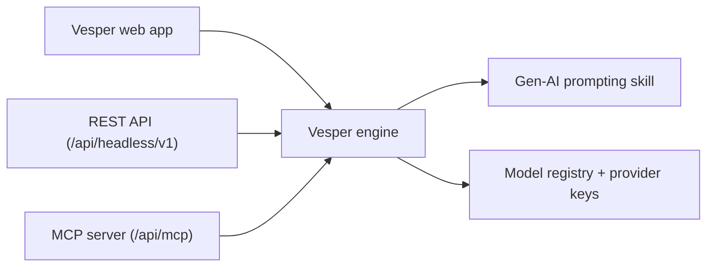

# Vesper Headless API + MCP

The Vesper headless surface lets external tools call Loop's prompt
substrate and (later) generation engine without ever receiving Gemini,
OpenAI, Replicate, or Anthropic API keys.

The same underlying engine powers four surfaces today:


```mermaid
flowchart LR
  WebApp["Vesper web app"] --> Engine["Vesper engine"]
  RestApi["REST API (/api/headless/v1)"] --> Engine
  McpServer["MCP server (/api/mcp)"] --> Engine
  Engine --> GenAiSkill["Gen-AI prompting skill"]
  Engine --> Models["Model registry + provider keys"]
```

External callers receive a `vsp_live_*` bearer token. The token is
scoped per credential, can be revoked, and never leaves the database in
plaintext after creation.

---

## 1. Auth model

| Concept | Where it lives | Notes |
|---------|----------------|-------|
| Owner profile | `Profile` (existing) | Every credential is owned by a Loop user. Paused / deleted owners cannot use their tokens. |
| Credential | `HeadlessCredential` | Hashed token, allowlists, rate-limit policy, revocation. |
| Audit log | `HeadlessUsageLog` | One row per request. |
| Rate buckets | `HeadlessRateBucket` | Durable per-credential minute + day buckets. |

Tokens look like `vsp_live_<16-hex-prefix>_<48-hex-secret>`. The prefix is
non-secret and used in dashboards and audit logs. Only the SHA-256 hash
is stored, so the database never sees the plaintext after issuance.

`INTERNAL_API_SECRET` is **not** used for headless auth. That secret
remains scoped to internal worker-to-worker calls and intentionally
bypasses resource checks; reusing it externally would be unsafe.

---

## 2. Issuing a credential (admin)

```bash
curl -X POST "$BASE_URL/api/admin/headless-credentials" \
  -H "Cookie: <admin session cookie>" \
  -H "Content-Type: application/json" \
  -d '{
    "ownerId": "<damien-profile-uuid>",
    "name": "Damien — Cursor",
    "allowedTools": ["enhance_prompt", "iterate_prompt", "list_models"],
    "allowedModels": [
      "gemini-nano-banana-pro",
      "gemini-nano-banana-2",
      "openai-gpt-image-2",
      "google-veo-3.1"
    ],
    "rateLimitPerMinute": 30,
    "rateLimitPerDay": 2000
  }'
```

The response includes the plaintext `rawToken` exactly once. Save it
immediately and hand it to the integrator over a secure channel.

To list credentials: `GET /api/admin/headless-credentials`.
To revoke: `DELETE /api/admin/headless-credentials/<id>` with optional
`{ "reason": "..." }` JSON body.

Set `allowedModels: ["*"]` for a full-access token. Empty `allowedModels`
means "no models", which still permits handshake and discovery but blocks
every tool call that requires a model.

---

## 3. REST API

Base URL: `https://<vesper-host>/api/headless/v1`

### `GET /` — discovery (no auth)

```bash
curl "$BASE_URL/api/headless/v1"
```

Returns the surface version, supported tools, and pointers to authenticated
routes. Useful for an integrator to confirm they're hitting Vesper before
configuring credentials.

### `POST /prompts/enhance`

```bash
curl -X POST "$BASE_URL/api/headless/v1/prompts/enhance" \
  -H "Authorization: Bearer $VSP_TOKEN" \
  -H "Content-Type: application/json" \
  -d '{
    "prompt": "documentary still of an elderly potter at a wheel",
    "modelId": "gemini-nano-banana-pro"
  }'
```

Response:

```json
{
  "originalPrompt": "documentary still of an elderly potter at a wheel",
  "enhancedPrompt": "...",
  "modelId": "gemini-nano-banana-pro",
  "enhancementModel": "claude-sonnet-4-5-20250929",
  "enhancementPromptId": null,
  "skill": {
    "skillId": "genai-prompting",
    "hash": "a1b2c3d4e5f6",
    "lastModified": "creative 0.5.0 (genai-prompting 1.0.2)",
    "source": "kit"
  }
}
```

`skill.source` names the prompting text that ran: `kit` (the Loop edition
from the creative kit), `db` (an admin override, Enhance only), `bundled`
(Vesper's own copy, when the kit cannot be read) or `fallback`.

Optional fields:

| Field | Purpose |
|-------|---------|
| `referenceImage` | `data:image/...;base64,...` URL. Triggers style-only or compositional enhancement based on prompt language. Capped at 6 MB. |

### `POST /prompts/iterate`

```bash
curl -X POST "$BASE_URL/api/headless/v1/prompts/iterate" \
  -H "Authorization: Bearer $VSP_TOKEN" \
  -H "Content-Type: application/json" \
  -d '{
    "prompt": "Loop Switch earplugs for focus workers",
    "modelId": "gemini-nano-banana-pro",
    "anchors": {
      "product": "Loop Switch",
      "offer": "Free shipping",
      "audience": "Focus workers in open offices",
      "brand": "Loop tone-of-voice rules; logo bottom-right"
    },
    "variantCount": 4,
    "preferredAxes": ["Concept", "Persona", "Visual Treatment"]
  }'
```

Returns the structured `slate` JSON (the Iteration Slate Mode schema in
`src/lib/prompts/iteration-slate-mode.ts`), written with the same
prompting text as `/prompts/enhance` but never the admin override, plus
the `skill` version block naming the source that ran.

### `GET /models`

```bash
curl "$BASE_URL/api/headless/v1/models" \
  -H "Authorization: Bearer $VSP_TOKEN"
```

Returns only the models the calling credential is permitted to use.

### Standard response headers

Every authenticated response includes:

```
X-RateLimit-Limit-Minute: 60
X-RateLimit-Remaining-Minute: 58
X-RateLimit-Reset-Minute: 27
X-RateLimit-Limit-Day: 5000
X-RateLimit-Remaining-Day: 4988
X-RateLimit-Reset-Day: 41280
```

When a window is exhausted, the response is `429` with a `Retry-After`
header.

### Error shape

Every error response is JSON-shaped:

```json
{
  "error": "human-readable message",
  "errorCategory": "auth | rate_limited | upstream_unavailable | content_safety | validation | internal"
}
```

`errorCategory` follows the same taxonomy as `lib/errors/classification.ts`,
so dashboards can compare browser and headless errors apples-to-apples.

---

## 4. MCP server

Base URL: `https://<vesper-host>/api/mcp`

The endpoint speaks MCP over Streamable HTTP (JSON-RPC 2.0 over POST).
It's compatible with:

- **Anthropic's MCP connector** (`mcp-client-2025-11-20` beta header).
- **Cursor's MCP host** (configured via Settings → MCP).
- **Any MCP runtime** that supports remote URL transports.

### Configuring Claude (MCP connector)

```bash
curl https://api.anthropic.com/v1/messages \
  -H "Content-Type: application/json" \
  -H "X-API-Key: $ANTHROPIC_API_KEY" \
  -H "anthropic-version: 2023-06-01" \
  -H "anthropic-beta: mcp-client-2025-11-20" \
  -d '{
    "model": "claude-opus-4-7",
    "max_tokens": 1024,
    "messages": [
      { "role": "user", "content": "Enhance this Nano Banana prompt and list the variants Andromeda would reward." }
    ],
    "mcp_servers": [
      {
        "type": "url",
        "url": "https://<vesper-host>/api/mcp",
        "name": "vesper",
        "authorization_token": "vsp_live_..."
      }
    ],
    "tools": [
      { "type": "mcp_toolset", "mcp_server_name": "vesper" }
    ]
  }'
```

Constraints from Anthropic's docs that we already satisfy:

- Public HTTPS server (Vercel deployment).
- Only `tools/*` methods are required for the connector — we expose
  `initialize`, `notifications/initialized`, `ping`, `tools/list`, `tools/call`.
- Bearer token is passed by the connector as `authorization_token`.

### Connecting Claude with your own sign-in

Add `https://<vesper-host>/api/mcp` as a custom connector in Claude and click
Connect: Claude sends you to Vesper's sign-in (OAuth 2.1), you allow it on
`/connect`, and Claude then acts in Vesper as you.

- **Who can connect.** A person whose Vesper sign-in has a confirmed email on
  one of `CLAUDE_ACCESS_DOMAINS` (default `loopearplugs.com`; signing in with
  Google confirms it) gets Claude access the first time they click Allow, with
  no admin step. Everyone else asks an admin to turn on Claude access under
  Settings, Users. Admins always pass.
- **An admin's decision wins.** Granting or revoking Claude access under Users
  records who decided and when (`profiles.mcp_access_decided_at`, `_by`), and
  the automatic grant never touches a profile with a decision, so someone an
  admin turned off stays off. Users shows whether access came automatically
  (`Claude (auto)`) or from an admin, and `Keep Claude Access Off` blocks a
  Loop account before it ever connects. The grant is logged as one
  `[claude-access]` line with the profile id and the domain, never the email.
- **A daily allowance instead of a switch.** Per person, over any rolling 24
  hours: `CLAUDE_DAILY_IMAGE_LIMIT` (default 40) images from `generate_asset`,
  `generate_product_image`, `cmf_render` and `packaging_finish` (a video from
  `generate_video` counts as one), and `CLAUDE_DAILY_GRADE_LIMIT` (default
  120) model reads by `grade_image` (three per grade by default). It is
  counted from what Vesper already records: MCP generations
  (`parameters.source = 'mcp'`, one per output, not the code-built packaging
  mockup), the CMF renders the web CMF Studio made (`source = 'web'`,
  `toolName = 'cmf_render'`), Vesper's own grades in `creative_grades` from
  either door, and calls still running in `headless_mcp_jobs` and
  `cmf_web_jobs`. The CMF Studio checks the same allowance before its renders
  and grades, so a person has one count across both doors, not one each. The
  check runs before anything is paid for; a refusal is an ordinary tool result
  (`isError`; a 429 in the web) saying how many were used, the limit and
  roughly when the next one frees up, and names both doors when the Studio's
  work is in the count. Admins are not limited. The rest of the web app is not
  affected. `0` turns that kind of work off through Claude for everyone, admins
  included (the shared organisation token is an admin's), and in the CMF
  Studio for everyone but admins. `MCP_DAILY_COST_CAP_USD` still applies on top
  when set.

### CMF supplier PDFs come from `cmf_pdf`

Supplier CMF PDFs are made by `cmf_pdf`, or by the same step in the CMF
Studio's PDF tab (`POST /api/cmf/v2/pdf`); the Studio's old packet export is
retired. Claude passes identifiers only: a workbook upload
(`import_id`, the file the CMF Studio keeps at `cmf/{owner}/imports/{id}.xlsx`),
a `tab`, `sku_columns` and one approved render per SKU (`output_ids`). Vesper
reads every value from that upload's cells.

- **One parse, two uses.** `cmf_prompt` and `cmf_render` take the same
  `import_id`, `tab`, `sku_column` and `clown`, fill Damien's template from the
  upload's cells, and the render records the import, the workbook's sha256, the
  SKU's cells as parsed, the prompt's sha256 and the clown's.
- **What `cmf_pdf` accepts.** Renders made that way, each with a yes from the
  CMF decider through `record_verdict` (matched by the email the product kit
  gives the decider), through the same clown key, which Damien has confirmed.
  A web Studio attempt is refused (its clown is not recorded), and so is a
  render whose cells have changed since, naming the fields.
- **The layout.** The retired CMF skill's document template: one render/spec
  page per SKU, then one shared part-breakdown page (the clown, a legend from
  the key, material, finish and technique per component, no per-colourway
  Pantone). The values follow the product repository's `spec-fields.md`: every
  printed value is its cell, the header's Edit date, Drawn and Checked
  included. Every page's footer reads
  `{workbook file} · modified {time} · sha256 {12}` and says where the time came
  from: the file's own save time, else the stored upload's Last-Modified.
- **The check before saving.** The built PDF is read back and compared with the
  same upload (`src/lib/creative/cmf/supplier-pdf-check.ts`). Any difference or
  empty required cell refuses, naming SKU, component, field, cell and both
  values, and nothing is saved. A clean PDF is stored at
  `cmf/{owner}/imports/{id}/pdf/{time}/{cmfCode}_{Product}_CMF_{Colorway}.pdf`
  and its link returned.

### CMF is the team's, in both doors

Every CMF step is one service, `src/lib/creative/cmf/service.ts`, which the
Claude tools and the web CMF Studio both call (next section); each takes the
person and the door, and the gate is CMF access on the profile, read fresh.

- **One team project.** Every CMF render, from Claude or the CMF Studio, is
  saved in the CMF team project (`projects.system_key = 'cmf'`, one per
  deployment), not in the maker's "Claude" project, with the same
  `parameters.creative` and the door in `parameters.source` (`mcp` or `web`).
  Every profile with CMF access is a member (a render joins its maker; the
  script below adds everyone once); one who loses the access is dropped the
  next time anyone renders. The daily allowance counts a render from either
  door against its maker, once.
- **What the team sees.** `cmf_list` shows the team's newest renders with their
  grade, the decider's answer and whether each can go on a supplier PDF, and
  the newest supplier PDFs. `grade_image` and `cmf_pdf` take any of the team's
  renders, whoever made them; an answer on a CMF render needs CMF access.
- **An upload's row.** `grade_image` with `import_id` reads the render against
  that upload's row, built by code as the product repository's `qa.py` builds
  THE ROW and THE KEY (`grading-row.ts`), instead of the kit's committed row; a
  render made from the upload needs only its `output_id`.
- **Supplier PDFs are listed.** Every PDF `cmf_pdf` saves gets a
  `cmf_supplier_pdfs` row: storage path, upload, SKU columns, renders, the clown
  key's sha256, the check, who made it, the door and when.
- **Before deploying.** Apply
  `prisma/migrations/20260930120000_cmf_team_records/migration.sql`, then move
  the renders Claude made so far with `npx tsx scripts/cmf-team-project.ts`
  (a dry run; `--apply` to act, `--owner <profile id>` for the project's owner).
- **The manifests.** `export_creative_records` with `kind: manifests` now also
  serves every `cmf_render`'s manifest lines, from either door.

### One CMF, two doors

The owner ruled (2026-09-30) that the headless engine is the behaviour, in
Claude and in the web alike. There is one CMF: the service. Claude's tools
(`src/lib/headless/tools/cmf.ts`, `grade_image` and `record_verdict` for
product `cmf`) and the web CMF Studio's routes
(`src/lib/creative/cmf/web-door.ts`, served at `/api/cmf/v2/*`) are two thin
doors onto it. Both parse their arguments with the same schemas
(`src/lib/creative/cmf/args.ts`), and a refusal is the service's own sentence
in both.

| Step | Claude | CMF Studio | Service |
|---|---|---|---|
| List | `cmf_list` | `GET list` | `listCmf` |
| Prompt | `cmf_prompt` | `POST prompt` | `cmfPrompt` |
| Render | `cmf_render` | `POST render`, then `GET render/{job}` | `planRender`, `runRender` |
| Grade | `grade_image` (product `cmf`) | `POST grade` | `planGrade`, `runGrade` |
| Answer | `record_verdict` (product `cmf`) | `POST verdict` | `recordCmfVerdict` |
| Supplier PDF | `cmf_pdf` | `POST pdf` | `supplierPdf` |
| Check a PDF | `cmf_check_pdf` | `POST check-pdf` | `checkPdf` |
| Upload a workbook | (names it by `import_id`) | `POST uploads`, `GET uploads/{id}` | `uploadWorkbook`, `readUpload` |
| Clowns and keys | (in `cmf_list`) | `GET keys` | `cmfKeys` |

- **The web actor.** The signed-in profile, door `web`, no credential, every
  model. Claude's is the credential's owner, door `mcp`. Records say which
  door made them (`parameters.source`, `cmf_supplier_pdfs.door`, a grade or
  answer with no credential); nothing else about them differs.
- **What only a door does.** Claude runs a long call inline or as a
  `headless_mcp_jobs` job. The web plans and refuses a render in the request,
  answers 202, and draws after the response in a `cmf_web_jobs` job the page
  polls; a grade waits in the request. Both check the one daily allowance.
- **The CMF Studio's tabs.** Workbook (upload the export; its tabs, SKUs by
  column letter and each key's state), Render (the exact prompt, read only,
  then the render), Review (the team's renders with their grade, every answer,
  a yes or no with why, and whether it counts as the decider's), PDF (the
  supplier PDF from eligible renders, its check, and past PDFs), History (made
  the old way, read only), and Clowns and keys (from the kit, read only).
- **Retired for CMF.** The web's own prompt (lighting presets, refinement
  text, a model rewrite), clown rotation and the Replicate fallback, the
  approve flag, `componentSpecs` editing, clown replacement and legend edits,
  and the packet PDF export. Their routes answer `410` with one line naming
  the step that replaced them (`src/lib/cmf/retired.ts`); the read routes stay
  and the tables are kept. `src/lib/cmf/{prompt,render,pdf}.ts` are imported
  by no route or component. Nothing made the old way goes into a supplier PDF.
- **Adding or changing a step.** The service first
  (`src/lib/creative/cmf/service.ts`, with its reach in `CmfServiceDeps` and a
  test in `tests/cmf-service.spec.ts`). Then both doors: the tool in
  `src/lib/headless/tools/cmf.ts` and the route in `web-door.ts` with its
  one-line `src/app/api/cmf/v2/*/route.ts`, parsing the same schema in
  `args.ts`. Then parity: a case in `tests/cmf-parity.spec.ts` holding the two
  answers equal. A step that only one door has is a drift; say why in the
  service if it must be.
- **The drift guard.** `tests/cmf-parity.spec.ts` (every route against its
  tool, on one kit, upload and person), `tests/cmf-import-lint.spec.ts` (no
  web CMF file imports `src/lib/cmf/{prompt,render,pdf,xlsx}` or
  `src/lib/models`), and `tests/cmf-tool-golden.spec.ts` (what Claude reads,
  byte for byte; rewrite it only on purpose, with `CMF_GOLDEN_WRITE=1`).
- **Before deploying.** Apply both migrations, in order:
  `20260930120000_cmf_team_records` and then `20260930140000_cmf_web_jobs`
  (`npx prisma db execute --file <migration.sql> --schema prisma/schema.prisma`),
  deploy, then run `npx tsx scripts/cmf-team-project.ts` as a dry run and
  again with `--apply`.

### Configuring Cursor

In Cursor's Settings → MCP → Add server:

```json
{
  "vesper": {
    "url": "https://<vesper-host>/api/mcp",
    "headers": {
      "Authorization": "Bearer vsp_live_..."
    },
    "timeout": 120000
  }
}
```

**Client timeout:** MCP clients (Claude Code, Cursor) default to ~60s per
tool call. Image generation under load can exceed that. Set `"timeout":
120000` (or higher) on the server entry in `mcp.json` / `.cursor/mcp.json`.
For claude.ai web connectors with a fixed wall, pass `async: true` on
`generate_asset` or use `generate_video` + `get_generation_status`.

Cursor will call `initialize`, `tools/list`, `prompts/list`, and
`resources/list` on first connect, then expose Vesper tools natively.

### Configuring a generic MCP client

The transport is plain JSON-RPC 2.0 over HTTP POST:

```bash
curl -X POST "$BASE_URL/api/mcp" \
  -H "Authorization: Bearer $VSP_TOKEN" \
  -H "Content-Type: application/json" \
  -d '{
    "jsonrpc": "2.0",
    "id": 1,
    "method": "initialize",
    "params": {
      "protocolVersion": "2025-11-25",
      "clientInfo": { "name": "damien-tool", "version": "0.1.0" }
    }
  }'
```

Then `tools/list` and `tools/call`.

---

## 5. Hard constraints

The headless surface intentionally refuses several things to keep blast
radius small:

| Constraint | Reason |
|------------|--------|
| No provider keys are exposed to callers. | A leak of a Vesper token cannot leak Loop's Gemini / OpenAI / Replicate credentials. |
| Empty `allowedModels` blocks every model call. | Default deny — admin must explicitly opt a model in. |
| `allowedTools` enforced on every REST and MCP call. | A leak cannot pivot from `list_models` to `iterate_prompt`. |
| Reference images capped at 6 MB (data URLs) or fetched https URLs. | Bounds memory; https chaining reuses prior Vesper Storage outputs. |
| `generate_asset` supports sync image models + async job queue. | Video uses `generate_video` + `get_generation_status`. |
| `allowFallback: false` disables silent Replicate routing on Gemini models. | Surfaces provider/isFallback in every generation response. |
| Inline images default on (`inlineBase64: true`). | Claude renders images in chat; set false for Cowork artifact bridge. |
| Plaintext token shown exactly once. | Lost tokens cannot be recovered — they must be re-issued. |

---

## 6. Operational notes

- Claude access decisions are recorded from migration
  `20260927120000_claude_access_decisions` on. Anyone an admin switched off
  before it has no decision on record, so a Loop account among them would get
  access again on its next connect: use `Keep Claude Access Off` under Users
  for those people.
- Rotate Damien's token by issuing a new credential, swapping it in his
  tooling, and revoking the old one. There's no in-place rotation API.
- Audit `HeadlessUsageLog` for unexpected spikes — every request is one
  row, including failures.
- Rate-limit buckets accumulate in `HeadlessRateBucket`. Old buckets are
  not pruned today; add a cron job once the table grows past comfort.
- `lastUsedAt` is updated best-effort. Use it to spot stale credentials.
- The MCP server is stateless — there's no session to keep alive between
  calls. Each MCP request must include the bearer token.
